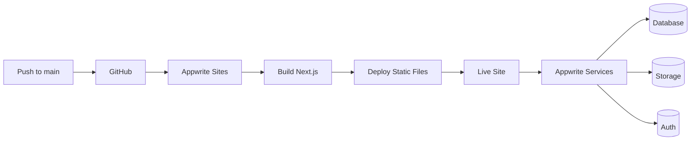

# Appwrite Sites Deployment Guide

This guide covers deployment of SFPLiberate to Appwrite Cloud using **Appwrite Sites** with Git Auto-Deploy integration.

## Table of Contents

- [Overview](#overview)
- [Prerequisites](#prerequisites)
- [Appwrite Project Setup](#appwrite-project-setup)
- [Database Schema Configuration](#database-schema-configuration)
- [Storage Buckets Configuration](#storage-buckets-configuration)
- [Authentication Configuration](#authentication-configuration)
- [Git Auto-Deploy Setup](#git-auto-deploy-setup)
- [Environment Variables](#environment-variables)
- [Testing Deployment](#testing-deployment)
- [Troubleshooting](#troubleshooting)

## Overview

**Appwrite Sites** is a static hosting service that automatically builds and deploys your application when you push to your Git repository. It's similar to Vercel or Netlify but integrated with Appwrite's backend services.

### Key Features

- ✅ **Automatic Deployments**: Push to GitHub → Appwrite builds and deploys
- ✅ **Auto-Injected Variables**: Appwrite automatically provides endpoint URLs and project IDs
- ✅ **Integrated Services**: Direct access to Appwrite Auth, Databases, and Storage
- ✅ **No Manual Builds**: Appwrite handles the entire build process
- ✅ **Custom Domains**: Support for custom domain configuration

### Deployment Architecture



## Prerequisites

Before deploying, ensure you have:

1. **Appwrite Cloud Account**
   - Sign up at https://cloud.appwrite.io
   - Free tier available (sufficient for testing)

2. **GitHub Repository Access**
   - Repository must be accessible to Appwrite
   - Admin access to configure GitHub integration

3. **Domain** (Optional)
   - Custom domain for production deployment
   - Can use Appwrite-provided subdomain for testing

## Appwrite Project Setup

### 1. Create Appwrite Project

1. Log in to [Appwrite Cloud Console](https://cloud.appwrite.io)
2. Click **"Create Project"**
3. Enter project details:
   - **Name**: SFPLiberate
   - **Region**: Choose closest to your users
4. Note your **Project ID** (e.g., `65abc123def456`)

### 2. Create Site

1. Navigate to **Sites** in the left sidebar
2. Click **"Create Site"**
3. Configure site:
   - **Name**: SFPLiberate Frontend
   - **Framework**: Next.js
   - **Build Command**: `npm run build`
   - **Output Directory**: `out`
   - **Install Command**: `npm ci --legacy-peer-deps`

### 3. Note Site ID

After creating the site, note the **Site ID** from the site settings. You'll need this for manual deployments via GitHub Actions.

## Database Schema Configuration

SFPLiberate requires the following database structure:

### 1. Create Database

1. Go to **Databases** in the Appwrite Console
2. Click **"Create Database"**
3. Database ID: `sfpliberate`
4. Name: `SFPLiberate Database`

### 2. Create Collections

#### Collection: `modules`

**Collection ID**: `modules`
**Name**: Community Modules

**Attributes**:

| Attribute | Type | Size | Required | Array | Default |
|-----------|------|------|----------|-------|---------|
| name | string | 255 | Yes | No | - |
| vendor | string | 255 | No | No | - |
| model | string | 255 | No | - |
| serial | string | 255 | No | No | - |
| sha256 | string | 64 | Yes | No | - |
| size | integer | - | Yes | No | - |
| blobId | string | 255 | Yes | No | - |
| photoId | string | 255 | No | No | - |
| comments | string | 5000 | No | No | - |
| wavelength | string | 100 | No | No | - |
| maxDistance | string | 100 | No | No | - |
| linkType | string | 100 | No | No | - |
| formFactor | string | 100 | No | No | - |
| connectorType | string | 100 | No | No | - |
| submittedBy | string | 255 | No | No | - |
| verified | boolean | - | Yes | No | false |
| downloads | integer | - | Yes | No | 0 |

**Indexes**:

| Key | Type | Attributes | Orders |
|-----|------|-----------|--------|
| sha256 | key | sha256 | ASC |
| createdAt | key | $createdAt | DESC |
| verified | key | verified | ASC |

**Permissions**:

- **Read**: Any (public read access)
- **Create**: Users (authenticated users can create)
- **Update**: Role:admin (only admins can update)
- **Delete**: Role:admin (only admins can delete)

### 3. Create Indexes

After creating attributes, create the following indexes:

1. **SHA256 Index**: For duplicate detection
   - Key: `sha256`
   - Type: Key
   - Attributes: `sha256` (ASC)

2. **Created At Index**: For sorting
   - Key: `createdAt`
   - Type: Key
   - Attributes: `$createdAt` (DESC)

3. **Verified Index**: For filtering
   - Key: `verified`
   - Type: Key
   - Attributes: `verified` (ASC)

## Storage Buckets Configuration

Create two storage buckets for binary EEPROM data and photos:

### 1. EEPROM Blobs Bucket

1. Go to **Storage** in the Appwrite Console
2. Click **"Create Bucket"**
3. Configure bucket:
   - **Bucket ID**: `blobs`
   - **Name**: EEPROM Blobs
   - **Max File Size**: 1MB (1048576 bytes)
   - **Allowed File Extensions**: `bin`
   - **Compression**: Disabled (binary data)
   - **Encryption**: Enabled
   - **Antivirus**: Enabled

**Permissions**:
- **Read**: Any (public read)
- **Create**: Users (authenticated users)
- **Update**: Role:admin
- **Delete**: Role:admin

### 2. Module Photos Bucket

1. Click **"Create Bucket"**
2. Configure bucket:
   - **Bucket ID**: `photos`
   - **Name**: Module Photos
   - **Max File Size**: 5MB (5242880 bytes)
   - **Allowed File Extensions**: `jpg, jpeg, png, webp`
   - **Compression**: Enabled
   - **Encryption**: Enabled
   - **Antivirus**: Enabled

**Permissions**:
- **Read**: Any (public read)
- **Create**: Users (authenticated users)
- **Update**: Role:admin
- **Delete**: Role:admin

## Authentication Configuration

### 1. Enable Authentication Methods

1. Navigate to **Auth** → **Settings**
2. Enable authentication methods:
   - ✅ **Email/Password** (required)
   - ❌ OAuth providers (optional)

### 2. Session Configuration

Configure session settings:
- **Session Length**: 365 days (adjust as needed)
- **Session Limit**: 10 (multiple devices)

### 3. Security Settings

- **Password History**: 5 (prevent password reuse)
- **Password Dictionary**: Enabled
- **Personal Data**: Enabled (check for common patterns)

### 4. Create Admin Role

Since this is an invite-only system, you'll manage users manually:

1. Go to **Auth** → **Teams**
2. Click **"Create Team"**
3. Team details:
   - **Name**: admin
   - **Team ID**: admin

4. Add initial admin user:
   - Go to **Auth** → **Users**
   - Click **"Create User"**
   - Enter email, password, and name
   - After creation, go to the user's details
   - Add label: `admin`

**Label System**:
- `admin`: Full access (verify, delete, manage)
- `alpha`: Early access (submit, browse)
- No label: Read-only access (browse only)

## Git Auto-Deploy Setup

This is the **recommended** approach for production deployments.

### 1. Connect GitHub Repository

1. In Appwrite Console, go to **Sites** → Your Site
2. Click **"Settings"** tab
3. Scroll to **"Git Repository"** section
4. Click **"Connect Git"**
5. Authorize Appwrite to access your GitHub account
6. Select repository: `Jammingway/SFPLiberate`
7. Configure Git integration:
   - **Production Branch**: `main`
   - **Root Directory**: `frontend`
   - **Build Command**: `npm run build`
   - **Install Command**: `npm ci --legacy-peer-deps`
   - **Output Directory**: `out`

### 2. Configure Build Settings

Appwrite will use the following settings from your `next.config.ts`:

```typescript
// Automatically detected when APPWRITE_SITE_API_ENDPOINT is present
output: 'export'  // Static export for Sites
```

### 3. Environment Variables

Appwrite Sites **automatically injects** these variables at build time:

| Variable | Description | Auto-Injected |
|----------|-------------|---------------|
| `APPWRITE_SITE_API_ENDPOINT` | Appwrite API endpoint | ✅ Yes |
| `APPWRITE_SITE_PROJECT_ID` | Your project ID | ✅ Yes |
| `APPWRITE_SITE_NAME` | Site name | ✅ Yes |
| `APPWRITE_SITE_DEPLOYMENT` | Deployment ID | ✅ Yes |

**Additional variables** (set in Appwrite Console):

Go to **Sites** → Your Site → **Settings** → **Environment Variables**:

```bash
# Feature Flags (optional - defaults to enabled)
APPWRITE_SITE_ENABLE_AUTH=true
APPWRITE_SITE_ENABLE_WEB_BLUETOOTH=true
APPWRITE_SITE_ENABLE_BLE_PROXY=true
APPWRITE_SITE_ENABLE_COMMUNITY_FEATURES=true

# Build Configuration
NEXT_TELEMETRY_DISABLED=1
NODE_ENV=production
```

### 4. Trigger First Deployment

1. Push to main branch:
   ```bash
   git push origin main
   ```

2. Monitor deployment:
   - Go to **Sites** → Your Site → **Deployments**
   - Watch build logs in real-time
   - Deployment typically takes 2-5 minutes

3. Access your site:
   - Click on the deployment URL (e.g., `https://your-site.appwrite.global`)
   - Or configure custom domain in **Settings** → **Domains**

### 5. Deployment Status

Appwrite will show deployment status:
- 🔵 **Building**: Build in progress
- ✅ **Ready**: Deployment successful and live
- ❌ **Failed**: Build failed (check logs)

## Environment Variables

### Auto-Injected by Appwrite Sites

These are provided automatically and **do not need** to be configured:

```bash
APPWRITE_SITE_API_ENDPOINT=https://cloud.appwrite.io/v1
APPWRITE_SITE_PROJECT_ID=your_project_id
APPWRITE_SITE_NAME=SFPLiberate Frontend
APPWRITE_SITE_DEPLOYMENT=deployment_id
APPWRITE_SITE_RUNTIME_NAME=node
APPWRITE_SITE_RUNTIME_VERSION=22
```

### Custom Variables (Set in Console)

Configure these in **Sites** → Your Site → **Settings** → **Environment Variables**:

```bash
# Feature toggles
APPWRITE_SITE_ENABLE_AUTH=true
APPWRITE_SITE_ENABLE_WEB_BLUETOOTH=true
APPWRITE_SITE_ENABLE_BLE_PROXY=true
APPWRITE_SITE_ENABLE_COMMUNITY_FEATURES=true

# Build settings
NEXT_TELEMETRY_DISABLED=1
NODE_ENV=production
```

### Feature Flag Behavior

The application automatically detects deployment mode:

```typescript
// frontend/src/lib/features.ts
export function getDeploymentMode(): DeploymentMode {
  // Auto-detect Appwrite deployment
  if (process.env.APPWRITE_SITE_API_ENDPOINT && process.env.APPWRITE_SITE_PROJECT_ID) {
    return 'appwrite';
  }
  // Otherwise, standalone (Docker)
  return 'standalone';
}
```

## Testing Deployment

### 1. Verify Deployment

After deployment completes:

1. **Access Site**: Visit the deployment URL
2. **Check Console**: Open browser DevTools → Console
3. **Verify Mode**:
   ```javascript
   // Should log "appwrite"
   console.log(window.ENV?.DEPLOYMENT_MODE);
   ```

### 2. Test Authentication

1. Click **Sign In** (should be visible in Appwrite mode)
2. Use credentials of a user you created
3. Verify successful login and redirect

### 3. Test Community Features

1. Navigate to **Community** page
2. Should see empty state (no modules yet)
3. Click **Submit Module** (requires authentication)
4. Test module submission form

### 4. Test Admin Access

1. Log in with admin user
2. Navigate to `/admin/submissions`
3. Should see submitted modules (if any)
4. Test verify and delete actions

## Troubleshooting

### Build Fails

**Error**: `Module not found: Can't resolve 'appwrite'`

**Cause**: Appwrite dependency not installed

**Solution**:
```bash
cd frontend
npm install appwrite
npm run build  # Test locally
```

### Environment Variables Not Working

**Error**: `APPWRITE_SITE_API_ENDPOINT is undefined`

**Cause**: Git Auto-Deploy not configured, or using manual deployment without variables

**Solution**:
1. Ensure Git repository is connected in Appwrite Console
2. Verify **Production Branch** is set to `main`
3. Check **Environment Variables** in site settings

### Database Permission Errors

**Error**: `User unauthorized for this action`

**Cause**: Collection permissions not configured correctly

**Solution**:
1. Go to **Databases** → `sfpliberate` → `modules`
2. Click **Settings** → **Permissions**
3. Ensure:
   - Read: `role:all` (or `any`)
   - Create: `role:users`
   - Update/Delete: `role:admin`

### Storage Upload Fails

**Error**: `File size exceeds maximum allowed size`

**Cause**: EEPROM file larger than bucket limit

**Solution**:
1. Go to **Storage** → `blobs` bucket
2. Edit bucket settings
3. Increase **Max File Size** to 1MB (1048576 bytes)

### Authentication Errors

**Error**: `Invalid credentials`

**Cause**: User not created or wrong password

**Solution**:
1. Verify user exists in **Auth** → **Users**
2. Reset password if needed
3. Check if user has correct labels (`admin` or `alpha`)

## Custom Domain Setup

### 1. Add Domain in Appwrite

1. Go to **Sites** → Your Site → **Settings** → **Domains**
2. Click **"Add Domain"**
3. Enter your domain: `sfpliberate.com`
4. Appwrite will provide DNS records to configure

### 2. Configure DNS

Add the following records to your DNS provider:

```
Type: CNAME
Name: @ (or subdomain)
Value: your-site.appwrite.global
TTL: 3600
```

### 3. Verify Domain

1. Wait for DNS propagation (up to 48 hours, usually <1 hour)
2. Click **"Verify"** in Appwrite Console
3. Appwrite will issue SSL certificate automatically
4. Domain will be marked as **Active** when ready

## Best Practices

### Development Workflow

1. **Test locally** with `DEPLOYMENT_MODE=appwrite`:
   ```bash
   cd frontend
   APPWRITE_SITE_API_ENDPOINT=https://cloud.appwrite.io/v1 \
   APPWRITE_SITE_PROJECT_ID=your_project_id \
   npm run build
   ```

2. **Use feature branches** for testing:
   - Create branch: `feature/test-deployment`
   - Push to test deployment workflow
   - Merge to main when ready

3. **Monitor deployments**:
   - Check deployment logs in Appwrite Console
   - Set up alerts for failed deployments (Appwrite Pro)

### Security

- ✅ **Rotate API keys** periodically
- ✅ **Use labels** for role-based access (not team memberships)
- ✅ **Enable antivirus** on storage buckets
- ✅ **Encrypt sensitive data** in database
- ✅ **Monitor authentication logs** for suspicious activity

### Performance

- ✅ **Enable compression** on photo bucket
- ✅ **Use CDN** for static assets (Appwrite provides this)
- ✅ **Lazy-load Appwrite SDK** (already implemented)
- ✅ **Index frequently queried fields** (sha256, createdAt, verified)

## Manual Deployment (Fallback)

If Git Auto-Deploy is unavailable, you can deploy manually using GitHub Actions.

### Prerequisites

1. Generate API key in Appwrite Console:
   - Go to **Overview** → **API Keys**
   - Create key with **Sites** scope
   - Copy API key (you won't see it again)

2. Add GitHub Secrets:
   - `APPWRITE_ENDPOINT_URL`: `https://cloud.appwrite.io/v1`
   - `APPWRITE_PROJECT_ID`: Your project ID
   - `APPWRITE_API_KEY`: API key from step 1
   - `APPWRITE_SITE_ID`: Your site ID

### Trigger Manual Deployment

```bash
# Push to feature branch
git push origin feature/appwrite-deployment

# Or manually trigger workflow
gh workflow run deploy-appwrite.yml --ref main
```

## Support

For issues or questions:

1. Check [Troubleshooting](#troubleshooting) section
2. Review [Appwrite Documentation](https://appwrite.io/docs)
3. Check GitHub Actions logs (for manual deployments)
4. Open issue with:
   - Deployment logs
   - Error messages
   - Steps to reproduce

---

**Last Updated**: January 2025
**Appwrite Version**: 1.6+
**Maintained By**: SFPLiberate Team
